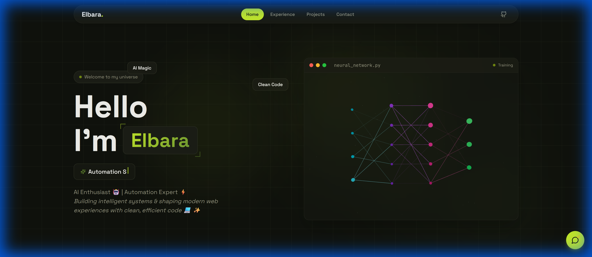

# 🚀 Elbara's AI-Powered Portfolio



> *Building intelligent systems & shaping modern web experiences with clean, efficient code.*

[](https://reactjs.org/)
[](https://www.typescriptlang.org/)
[](https://vitejs.dev/)
[](https://tailwindcss.com/)
[](https://n8n.io/)
[](https://www.framer.com/motion/)

## ✨ Overview

Welcome to my digital universe! This portfolio is a demonstration of my engineering capabilities in AI and Automation. Built with a modern tech stack, it features interactive 3D visualizations, live automation feeds, and a sleek, responsive design system.

## 🌟 Key Features

*   **🧠 Neural Network Visualization**: An interactive 3D neural network built with **React Three Fiber**, representing my passion for AI and deep learning.
*   **⚡ n8n Automation Specialist**:
    *   **Workflow Visualizer**: Interactive pipeline visualization of complex n8n automations.
    *   **Live Activity Feed**: A real-time terminal-style log showing proof of work and system status.
    *   **Free Templates Gallery**: A collection of ready-to-use n8n blueprints for lead gen, AI agents, and more.
*   **🤖 AI Chat Assistant**: A fully functional chat widget powered by LLMs, allowing visitors to ask questions about my experience.
*   **🎨 Dynamic Design System**: A custom-built design system using **Tailwind CSS** with neon aesthetics, glassmorphism, and dark mode support.
*   **🎬 Smooth Animations**: Immersive page transitions and micro-interactions powered by **Framer Motion**.

## 🛠️ Tech Stack

*   **Frontend**: React, TypeScript, Vite
*   **Styling**: Tailwind CSS, Shadcn UI, Lucide Icons
*   **Automation**: n8n (Workflow Design, Custom Nodes)
*   **Animation**: Framer Motion
*   **3D Graphics**: React Three Fiber (Three.js)
*   **Backend/AI**: Supabase, OpenAI, Groq, Gemini

## 🚀 Getting Started

Follow these steps to run the project locally:

1.  **Clone the repository**
    ```bash
    git clone https://github.com/elbara99/Portfolio.Me.git
    cd Portfolio.Me
    ```

2.  **Install dependencies**
    ```bash
    npm install
    ```

3.  **Run the development server**
    ```bash
    npm run dev
    ```

4.  **Build for production**
    ```bash
    npm run build
    ```

## 📂 Project Structure

```
src/
├── components/        # Reusable UI components
│   ├── WorkflowsGallery.tsx # n8n Template collection
│   ├── AutomationFeed.tsx   # Live activity log
│   ├── WorkflowVisualizer.tsx # Pipeline visualization
│   └── Hero.tsx      # Main landing section
├── Freeworkflows/    # Redacted n8n JSON templates
├── pages/            # Route components
├── hooks/            # Custom React hooks
└── index.css         # Global styles
```

## 📬 Contact

I'm always open to discussing new projects, creative ideas, or opportunities to be part of your visions.

*   **GitHub**: [elbara99](https://github.com/elbara99)
*   **LinkedIn**: [Elbara Mouaffak](https://www.linkedin.com/in/elbara-mouaffak-781655206/)
*   **Email**: [elbaraemoueffek@gmail.com](mailto:elbaraemoueffek@gmail.com)

---

*Designed and developed with ❤️ by Elbara.*
